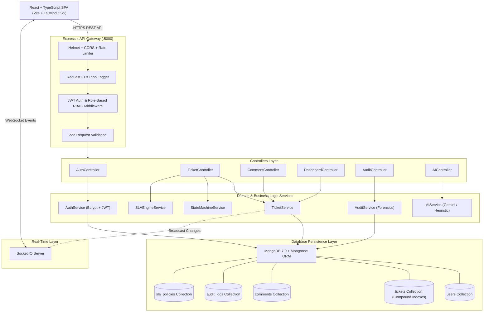
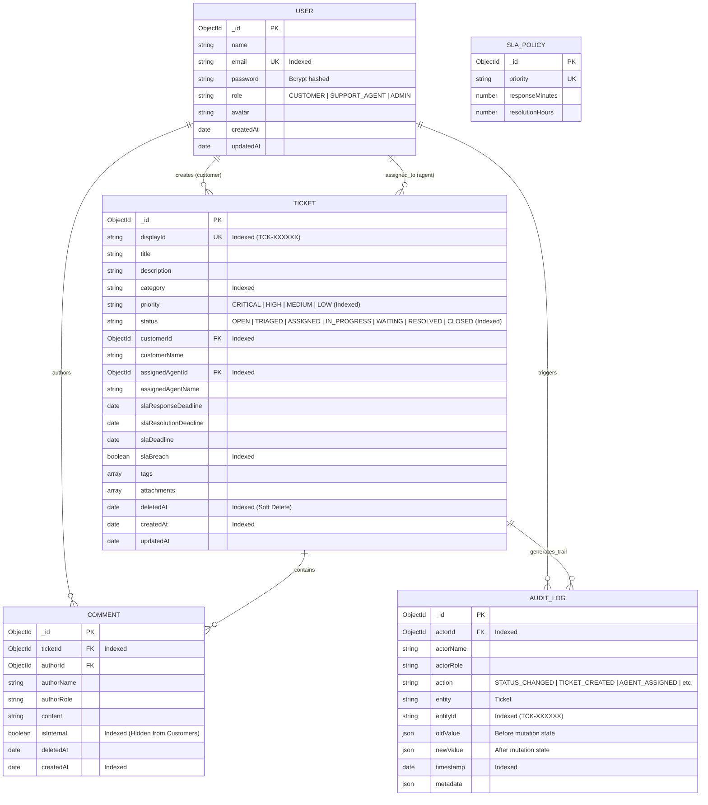
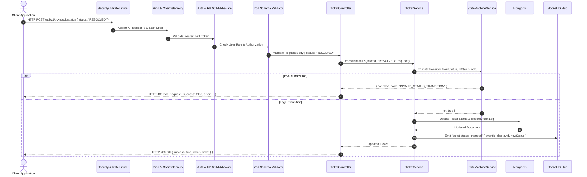

# System Architecture Document

## 1. System Architecture Overview

The ServiceDesk platform is built following a clean, layered architectural pattern ensuring strict separation of concerns across presentation, business logic, persistence, and observability layers.

---

## 2. Component Architecture & Separation of Concerns

The backend strictly avoids monolithic handler anti-patterns by enforcing four decoupled tiers:

1. **Routing & Middleware Tier** (`src/routes/`, `src/middleware/`):
   * Attaches unique `X-Request-Id` for distributed trace correlation.
   * Enforces security headers via `helmet` and IP rate-limiting.
   * Performs runtime input validation using `Zod` schemas.
   * Decodes and validates JWT tokens, populating `req.user`.

2. **Controllers Tier** (`src/controllers/`):
   * Orchestrates HTTP request/response lifecycles.
   * Maps incoming parameters to domain service calls.
   * Returns standardized JSON envelopes: `{ success: true, data: ..., requestId: ... }`.

3. **Domain Services Tier** (`src/services/`):
   * Implements pure business logic without Express couplings.
   * **`stateMachineService`**: Validates legal state transitions and returns formal error structures.
   * **`slaService`**: Computes response and resolution timestamps in UTC.
   * **`auditService`**: Emits immutable change records with deep object diffs.
   * **`aiService`**: Pluggable provider for intelligent summarization and triage.

4. **Persistence & Data Modeling Tier** (`src/models/`):
   * Mongoose schemas with compound indexes optimized for pagination, filtering, and role-based isolation.
   * Soft-delete data retention enforcement (`deletedAt: null`).

---

## 3. MongoDB Data Model & Entity Relationship (ER) Diagram

### Database Indexing Strategy
To ensure sub-millisecond query performance on datasets exceeding 10,000+ tickets (Section 20):
* `{ customerId: 1, deletedAt: 1, createdAt: -1 }`: Fast customer portal pagination.
* `{ assignedAgentId: 1, deletedAt: 1, status: 1 }`: Fast agent queue filtering.
* `{ status: 1, priority: 1, deletedAt: 1 }`: Accelerated triage and analytics aggregations.
* `{ title: "text", description: "text", category: "text" }`: Full-text search support.

---

## 4. Request Lifecycle & Pipeline

---

## 5. Authentication & Token Lifecycle

* **Registration (`POST /api/v1/auth/register`)**: Passwords hashed with `bcryptjs` (salt rounds: 10). Emits access token (15m) and refresh token (7d).
* **Login (`POST /api/v1/auth/login`)**: Validates credentials via `comparePassword()`. Returns scoped tokens containing `userId`, `email`, `role`, and `name`.
* **Token Rotation (`POST /api/v1/auth/refresh`)**: Validates the refresh token secret and verifies user persistence before generating fresh token pairs.
