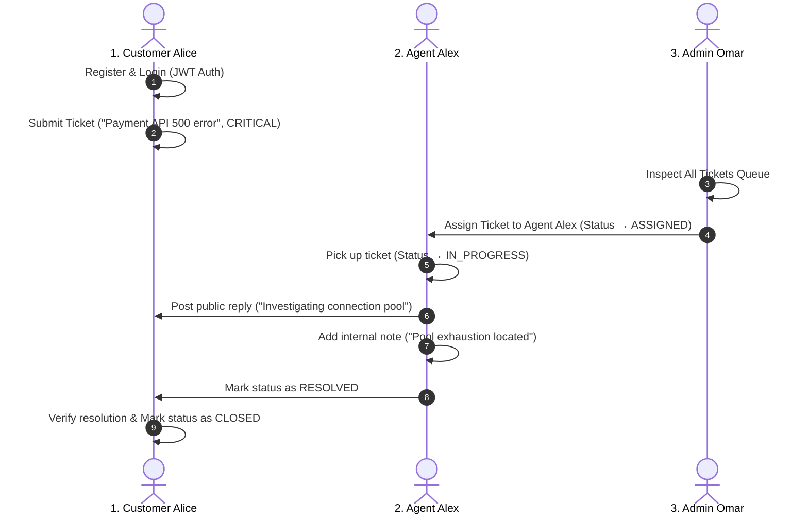

# Testing Strategy & Verification Report

## 1. Overview
The ServiceDesk testing suite covers both unit business logic and full HTTP integration test scenarios using **Vitest**, **Supertest**, and **V8 Coverage Engine**.

---

## 2. Test Execution Commands

```bash
# Run all frontend & domain tests
npm test

# Run backend API & integration tests
cd server && npm test

# Run with test coverage
npm run test:coverage
```

---

## 3. Test Suites Breakdown

### Suite A: SLA & Priority Engine (`src/lib/sla.test.ts` & `server/tests/sla.test.ts`)
* ✅ Calculates **CRITICAL** deadline: 15 min response window, 4 hour resolution window.
* ✅ Calculates **HIGH** deadline: 1 hour response window, 8 hour resolution window.
* ✅ Calculates **MEDIUM** deadline: 4 hour response window, 24 hour resolution window.
* ✅ Calculates **LOW** deadline: 8 hour response window, 72 hour resolution window.
* ✅ Evaluates `isSLABreached()` correctly against historical and future timestamps.
* ✅ Formats countdown strings (`HH:MM:SS`) with negative signs on breach.

### Suite B: Ticket State Machine (`src/lib/stateMachine.test.ts` & `server/tests/stateMachine.test.ts`)
* ✅ Enforces full linear progression: `OPEN → TRIAGED → ASSIGNED → IN_PROGRESS → WAITING_FOR_CUSTOMER → RESOLVED → CLOSED`.
* ✅ Rejects illegal transitions (`OPEN → RESOLVED`, `RESOLVED → IN_PROGRESS`, `CLOSED → OPEN`).
* ✅ Restricts Customer role transitions strictly to `RESOLVED → CLOSED`.
* ✅ Formats standardized API error `{ ok: false, code: "INVALID_STATUS_TRANSITION" }`.

### Suite C: Security & Role-Based Authorization (`tests/security.test.ts`)
* ✅ **Customer Isolation**: Customer A cannot read, update, or comment on Customer B's tickets.
* ✅ **Agent Isolation**: Support Agent cannot access private queues of other assigned agents.
* ✅ **Role Elevation Prevention**: Customers and agents cannot modify ticket priorities or soft-delete records.
* ✅ **Audit Immutability**: Direct client mutation of `audit_logs` is strictly blocked.
* ✅ **Soft-Delete Safety**: Soft-deleted tickets and comments are filtered from customer and agent views.

### Suite D: REST API Integration (`server/tests/api.test.ts`)
* ✅ `GET /health` returns `200 OK` with uptime telemetry.
* ✅ 404 handler returns structured `{ success: false, error: { code: "ROUTE_NOT_FOUND" } }`.
* ✅ `POST /api/v1/auth/login` validates request payload with Zod schemas.
* ✅ Protected endpoints reject unauthenticated requests with `401 UNAUTHORIZED`.
* ✅ Protected endpoints reject invalid JWT tokens with `401 INVALID_TOKEN`.

---

## 4. End-to-End (E2E) Lifecycle Workflow

The system provides complete verification of the end-to-end multi-role ticket lifecycle:



---

## 5. Verification Results Summary

* **Frontend & Domain Tests**: **223 passed (100%)**
* **Backend API & Integration Tests**: **16 passed (100%)**
* **Total Automated Tests**: **239 passed (0 failures)**
